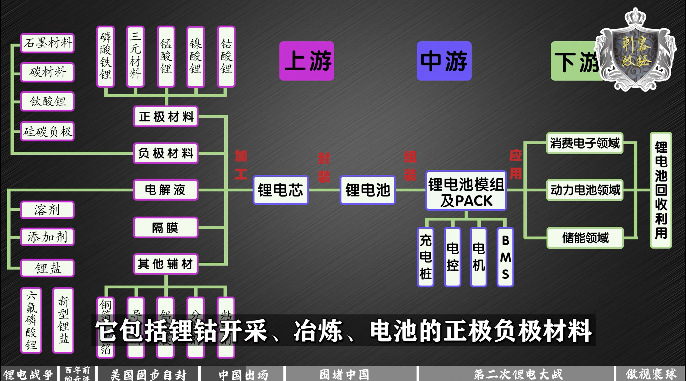

# The Situation of Mainstream High and New Tech

## 科技状况总论

* 计算机视觉九大应用场景：`人脸识别、视频/监控分析、图像识别分析、辅助/自动驾驶、三维图像视觉、工业视觉检测、医疗影像诊断、文字识别、图像及视频编辑`
* 计算机视觉技能树：
  ```
  基础技能：相机原理、3D计算机视觉、low-level视觉与图像处理、视觉神经科学、统计机器学习、深度学习、线性代数、数学分析、概率论与数理统计
  中间层技能：图像分割、图像分类、目标检测、目标跟踪、视频（序列图像）分析
  应用层技能：OCR、图像检索、图形识别、视频内容理解（直播鉴黄、盗版检测等）、手势识别、人脸识别、图像/视频编辑和风格化、智能视频分析、
          图像与NLP结合、3D重建、工业视觉、无人驾驶、医疗影 像诊断、神经网络芯片
  ```
* 第四次工业革命中的五大新科技领域：`碳基材料、基因工程、人工智能、量子科学、核聚变`
* 美国的四大优势：`高科技、美元、美军、好莱坞`
* 科学如何作用于社会：`基础研究；应用研究；工业技术；日常生活；研发投入`

## 芯片制造相关

* 摩尔定律：`当价格不变时，集成电路上可容纳的元器件的数目，约每隔18-24个月便会增加一倍，性能也将提升一倍。`
* 芯片制造的八大材料：`硅片、电子特气、光掩模、光刻胶、光刻胶辅助材料、湿化学品、靶材、抛光`
* 芯片制造的八大设备：`扩散、薄膜沉积、光刻、刻蚀、离子注入、CMP抛光、清洗、测试`
* 完整的芯片制造包括三大部分：`单晶硅片制造；前道工序；后道工序`。每部分又依次分别包括以下几部分
  ```
  单晶硅片制造：拉单晶、磨外圆、切片、倒角、磨削或研磨、CMP
  前道工序：扩散、薄膜沉积、光刻、刻蚀、离子注入、CMP、金属化、测试
  后道工序：背面减薄、晶圆切割、贴片、引线键合、模塑、切筋/成型、终测
  ```

* 芯片代工厂国产技术设备发展状况（截止到2020年11月）


## 锂电池相关




## 科学技术与商业经济关系的辩证思考

* 中国终将获胜的三点理由：`中国的人口规模与活力：“百国之和”；全社会对企业发展的支持；全球信息化与中国文化的组织执行力结合。`
* 史正富：中国特色的社会主义市场经济体制，是一个包含了战略性的中央政府、竞争性的地方政府和竞争性的企业系统的三位市场体制。
* 在由互联网带来的全球信息化时代，中国的文化里面，在组织和执行力方面的优势，将远大于我们在创新方面可能的劣势。
* 在信息化时代，创新的优势被降低了，创新承担了大量的试错成本，可创新一旦发生后，真正的胜利往往会被那些能够产业化的企业夺取。
* 当然，在预测中国企业的光明前途后，如果没有进一步思考企业和社会的关系，（我）就很难做一个合格的社会主义国家投资人。
* “牺牲红利”概念：中国今天所有的财富，都离不开无法被定价的八十年的“牺牲红利”。
* 市场是商品和服务建立价格并完成交易的过程，而市场经济是通过市场来配置社会资源的一种经济形态，从某种意义上来说，市场经济是基于社会这个广阔主体上的一个财富游戏。
* 经济的金融化：市场经济的参与者通过数学公式产生出更多可交易的虚拟结构，比如股权、债权、期权等等，并从这些交易中获得丰厚的利润。
* 2020新冠疫情大考年，价值创造者和利益获得者完全错配。在这里，商业不是最大的慈善，商业是最大的慈善对象。
* “十四五”规划：提高劳动报酬在初次分配中的比重，完善再分配机制，加大税收、社保、转移支付等调节力度和精确性，发挥第三次分配作用，发展慈善事业，改善收入和财富分配格局。
* 服务电商是有一个巨大的机会，这来自于我们国家的信息化的基础非常之强，未来全球最大的服务类交易平台一定出现在中国。
* 中国人的财富或资产，在疫情期间和在疫情之后，都有了分化（穷的还是穷，富的更富）。
* 包括科学界也得有这个意识，你不要永远跟着人家西方国家的选题走，不敢提出自己的选题，这样你就无法创新。
* 所有的学问其实最终它还是要解决问题，不能只是一个学术圈子，自得其乐，搞一些谁也看不懂的模型，而这个模型是机器理想化的，把所有的变量都排除在外的。
* 基辛格：伟大的事业往往需要一点天真来推动


## 新冠疫情之后的一些思考：知难而进、临危见机

* 人类历史走过的七个发展阶段
```
第一阶段：劳动密集型产业 ---- 无产阶级、工人阶级、农名阶级生存的前提；没有资产，只能出卖劳动力创造财富和价值
第二阶段：资源密集型产业 ---- 少数人均GDP很高的国家，很少的人口占据大量的资源，比如科威特和沙特阿拉伯，某种程度上俄国和委内瑞拉也算
第三阶段：轻工业 ---- 投入资本少、技术简单，所谓的东亚模式或亚洲四小龙模式，就是依靠轻工业出口产品，获得外汇积累资本起家
第四阶段：重工业和军事工业 ---- 为了维护国家的独立和自主，没有机会先发展较简单的轻工业，而是优先发展重工业和高科技（国防相关军用产品）
第五阶段：知识产业 ---- 依靠卖知识的高端服务产业。中国目前还在发展阶段，需要选择性地学习引进经过实践检验了的法律和金融知识
第六阶段：文化产业 ---- 美国有依靠好莱坞在全世界宣传的美国梦，中国也应有自己土生土长扎根在中国发芽于世界的中国梦，这项工作还刚刚起步
第七阶段：生活方式 ---- 以美国为首的西方发达国家妄图征服自然，大打生物战；中国则讲究天人合一、食饮有节、起居有常、亲近自然、乐天知命
```
* 中国片面学习西方带来的新三座大山：教育、医疗、养老

## 新时代浪潮

* 教员那一代人的使命是解决中国人挨打的问题，总设计师那一代人的使命是解决中国人挨饿的问题，我们这一代人的使命是解决中国人挨骂的问题
* 不必时时怀念我，也不要指望我回来，我离开在以后，你们就是我，人民万岁
* 中国青年意识到，人类之间的误解，源自对世界基本的认知不同
* 社交网络的兴起，没有让世界变得更平，反而放大了信息隔阂，让世界进入了“鸡同鸭讲”时代，互联网让世界变得更平，但社交网络让世界褶皱起来

## 智能手机相关

Smartphone Shipment Market：SAMSUNG HUAWEI  XIAOMI  APPLE OPPO  VIVO  REALME  LENOVO-GROUP  LG  TECNO


## 互联网企业与公司

* 2020世界排名前20互联网公司：`微软、亚马逊、谷歌、Facebook、腾讯、阿里巴巴、蚂蚁金服、美团、S/F、PayPal、Netflix、ORACLE、拼多多、京东、今日头条、Uber、Booking、网易、滴滴、百度`

## 支柱产业房地产

* 1、[【天涯 kkndme 神贴聊房价】](https://github.com/shengcaishizhan/kkndme_tianya)[[house PDF](https://github.com/wenbochang888/house)]
* 2、[【全国各省市烂尾楼停贷通知汇总】](https://github.com/WeNeedHome/SummaryOfLoanSuspension)


## 英文论文写作规范相关

* 1、[老外写的中国学生的英文文章问题(2011年): The Most Common Habits from more than 200 English Papers written by Graduate Chinese Engineering Students](http://blog.lib.sjtu.edu.cn/smse/attachments/month_0905/a2009515144152.pdf)
* 2、[Advice on Research and Writing [A collection of advice about how to do research and how to communicate effectively (primarily for computer scientists).]](http://www.cs.cmu.edu/afs/cs.cmu.edu/user/mleone/web/how-to.html)


## 模拟位置修改器（Android APP）

* [(github) Android app that mocks the GPS and Network location providers.](https://github.com/warren-bank/Android-Mock-Location)
