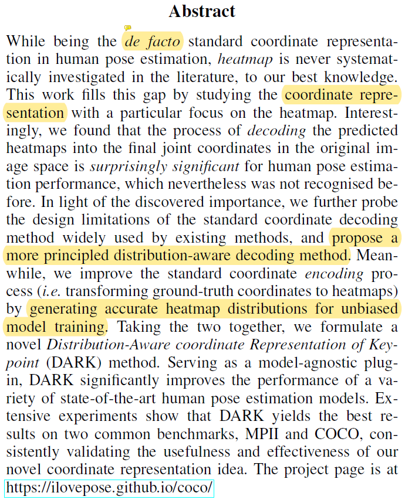
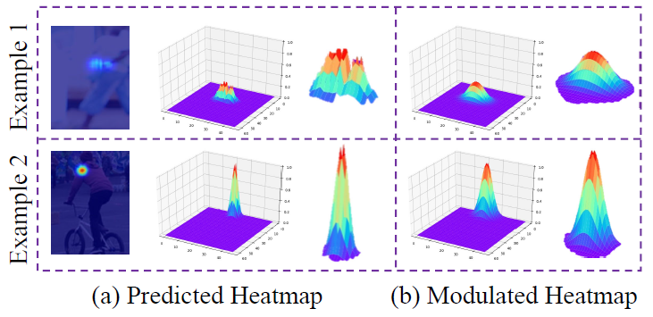
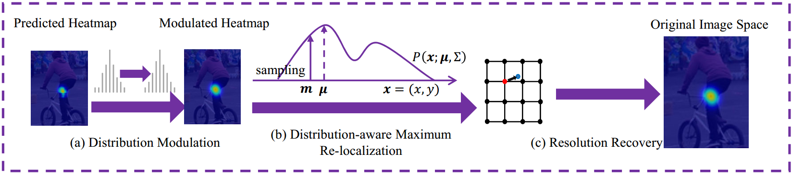

# DarkPose(CVPR2020)

Paper URL: https://arxiv.org/abs/1910.06278

Main authors in this paper are all Chinese from UESTC. For details about test and training, please refer the original code [ilovepose/DarkPose](https://github.com/ilovepose/DarkPose). Official Declaration: Serving as a model-agnostic plug-in, DARK significantly improves the performance of a variety of state-of-the-art human pose estimation models! The backbone used in this paper is HRNet.

## 0) Abstract


```
*While being the de facto standard coordinate representation in human pose estimation, heatmap is never systematically investigated in the literature, to our best knowledge. This work fills this gap by studying the coordinate representation with a particular focus on the heatmap. Interestingly, we found that the process of decoding the predicted heatmaps into the final joint coordinates in the original image space is surprisingly significant for human pose estimation performance, which nevertheless was not recognised before. In light of the discovered importance, we further probe the design limitations of the standard coordinate decoding method widely used by existing methods, and propose a more principled distribution-aware decoding method. Meanwhile, we improve the standard coordinate encoding process (i.e. transforming ground-truth coordinates to heatmaps) by generating accurate heatmap distributions for unbiased model training. Taking the two together, we formulate a novel Distribution-Aware coordinate Representation of Keypoint (DARK) method. Serving as a model-agnostic plug-in, DARK significantly improves the performance of a variety of state-of-the-art human pose estimation models. Extensive experiments show that DARK yields the best results on two common benchmarks, MPII and COCO, consistently validating the usefulness and effectiveness of our novel coordinate representation idea.*
```

## 1) Introduction

DarkPose is working as a plug-in to tackling the *Inaccuracy of Traditional Keypoint Heatmap Representation*.



DarkPose(DARK means Distribution-Aware coordinate Representation of Keypoint) is from paper named **Distribution-Aware Coordinate Representation for Human Pose Estimation**. It's not a new independent pose estimation algorithm but serving as a plug-in that is attached to a variety of other algorithms. This work fills the gap by studying the coordinate representation with a particular focus on the heatmap. Refer to the figure below. We will explain the details of this paper later.



## 2) Intensive Reading

## 3) Citation
Please cite the paper in your publications if it helps your research:
```
@InProceedings{Zhang_2020_CVPR,
    author = {Zhang, Feng and Zhu, Xiatian and Dai, Hanbin and Ye, Mao and Zhu, Ce},
    title = {Distribution-Aware Coordinate Representation for Human Pose Estimation},
    booktitle = {IEEE/CVF Conference on Computer Vision and Pattern Recognition (CVPR)},
    month = {June},
    year = {2020}
}
```
