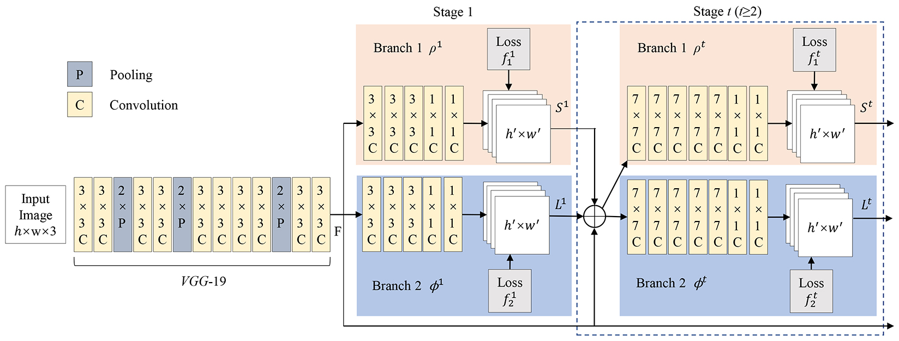
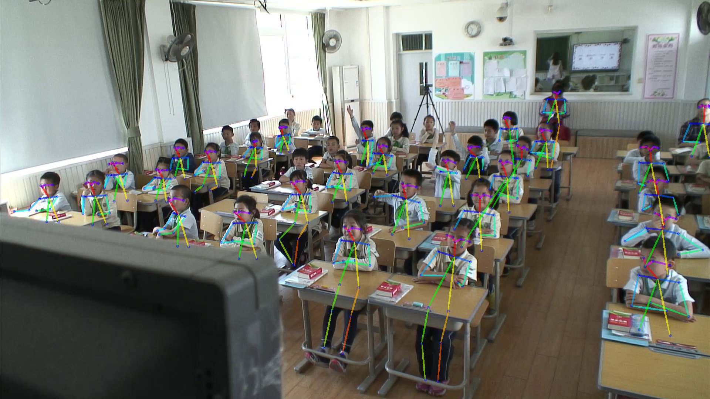
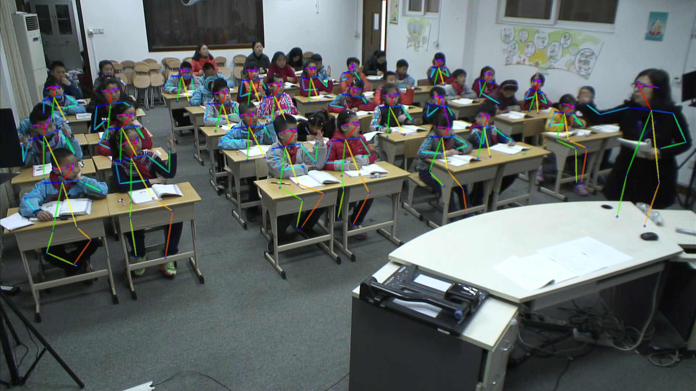
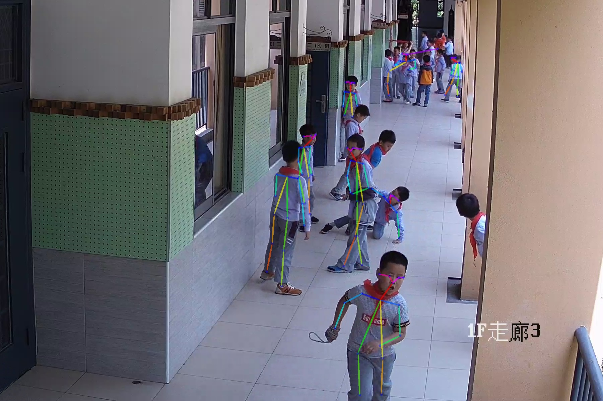

# PAF (or named CMU-OpenPose)
This code repo is a PyTorch version of *Realtime Multi-Person Pose Estimation*. It only inlcudes improved and reorganized test code rather than train code. For details about training your own model, please reference the origin code [Realtime Multi-Person Pose Estimation](https://github.com/ZheC/Realtime_Multi-Person_Pose_Estimation)

## Introduction
This PAF algorithm is from an Oral paper 2017 CVPR. It is a milestone in the bottom-up branch. Thanks to the universality of method design and the thoroughness of open source, it is still the most widely used method even today, including practical applications and other complex visual tasks research. 

The deep model part of it uses VGGNet to extract image features, and then divides into two branchs and multiple stages to predict the heatmaps of keypoints and the auxiliary vector PAFs used to help connect limbs, respectively. These iterations draw lessons from CPM(CVPR2016). It's released source codes are here [Convolutional Pose Machines](https://github.com/shihenw/convolutional-pose-machines-release). The Network Architecture for predicting heatmaps and PAFs is as follows. After that, it needs to use faster greedy matching to decode heatmaps and PAFs to get keypoints and limbs connection for every person pose.

## Environment
Codes are only tested Under Python2.7. Besides, you need to install [Pytorch](http://pytorch.org/) and OpenCV with pip

## Testing
- `git clone https://github.com/hnuzhy/CV_DL_Gather/pose_estimation/PAF_CMU-OpenPose/` download test codes in your machine.
- `cd model` and download [pre-trained model](https://pan.baidu.com/s/1kLM_7LGJ19gKJ4a9VIMMAQ) to put it under this folder. PassWord is：**lt7h**
- `python eval_images.py` to run test script. It will predict images under *./test_imgs/classroom_test/*. You can change `folderList` in `eval_images.py` to test your own images.
- `cd src && vim config_file` You can edit *config_file* to change config for trade-off between detection accuracy and inference latency. `scale_search = 0.5, 1, 1.2, 1.5` is for image multi-scale detection. `scale_ratio = 0.5` will resize original image smaller to reduce time. `pk_mode = 'fullKP'` changes in ['fullKP', 'PK12'] for faster run.

## Results

Below three images are detected with config: `scale_search = 0.5, 1, 1.2, 1.5` , `scale_ratio = 0.5` and `pk_mode = 'fullKP'`. The average time consumed is about 2.5 seconds. NOTE：`plot_pose(all_keypoints, canvas, imageName, resultSavePath, save_joints_info=True)` in `eval_images.py` should be comment out when computing time.  
The first two 1K (1920x1080) images are from classroom, and the last one is from lobby 4K (3840x2160) camera. It is cropped to 1800x1200 covering only key areas with students.

## Related repository
- CVPR'16, [Convolutional Pose Machines](https://github.com/shihenw/convolutional-pose-machines-release).
- CVPR'17, [Realtime Multi-Person Pose Estimation](https://github.com/ZheC/Realtime_Multi-Person_Pose_Estimation).
