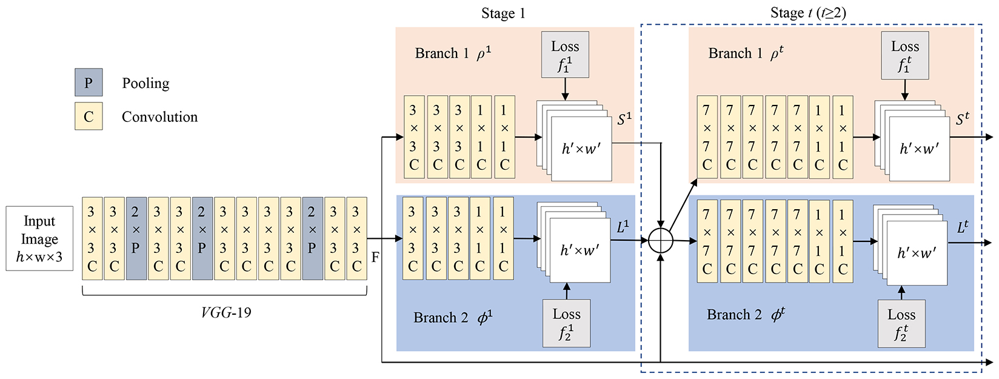

# PAF (or named CMU-OpenPose)

Paper URL: 

For codes This code repo is a PyTorch version of *Realtime Multi-Person Pose Estimation*. It only inlcudes improved and reorganized test code rather than train code. For details about training your own model, please reference the origin code [Realtime Multi-Person Pose Estimation](https://github.com/ZheC/Realtime_Multi-Person_Pose_Estimation)

## 1) Introduction
This PAF algorithm is from an Oral paper 2017 CVPR: **Realtime Multi-Person 2D Pose Estimation using Part Affinity Fields**. It is a milestone in the bottom-up branch. Thanks to the universality of method design and the thoroughness of open source, it is still the most widely used method even today, including practical applications and other complex visual tasks research. 

The deep model part of it uses VGGNet to extract image features, and then divides into two branchs and multiple stages to predict the heatmaps of keypoints and the auxiliary vector PAFs used to help connect limbs, respectively. These iterations draw lessons from single person pose estimation CPM(CVPR2016). It's released source codes are here [Convolutional Pose Machines](https://github.com/shihenw/convolutional-pose-machines-release). The Network Architecture for predicting heatmaps and PAFs is as follows. After that, it needs to use faster greedy matching to decode heatmaps and PAFs to get keypoints and limbs connection for every person pose.




## 2) Citation
Please cite the paper in your publications if it helps your research:
```
@inproceedings{cao2017realtime,
  author = {Zhe Cao and Tomas Simon and Shih-En Wei and Yaser Sheikh},
  booktitle = {CVPR},
  title = {Realtime Multi-Person 2D Pose Estimation using Part Affinity Fields},
  year = {2017}
  }
  
@inproceedings{wei2016cpm,
  author = {Shih-En Wei and Varun Ramakrishna and Takeo Kanade and Yaser Sheikh},
  booktitle = {CVPR},
  title = {Convolutional pose machines},
  year = {2016}
  }
```
