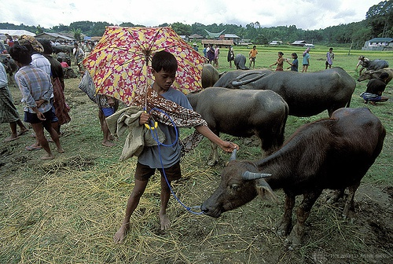
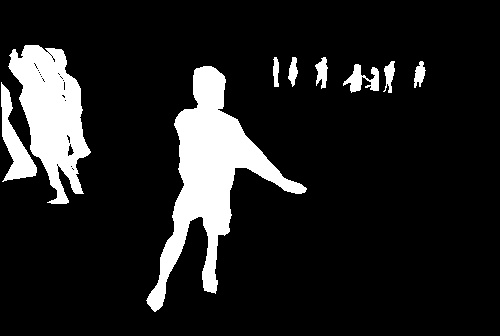
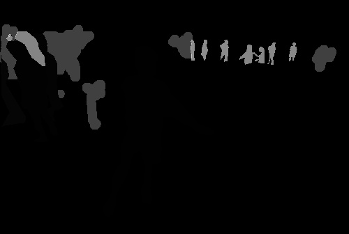

This file *generate_hdf5.py* mainly introuce some tricks for encoding masks in COCO using pycocotools API.

# Preparing

You should install pycocotools in your Python. Linux directly use `pip install pycocotools`. Windows (Must have Visual Studio Build Tools) please use `pip install git+https://github.com/philferriere/cocoapi.git#subdirectory=PythonAPI`.

Also please download the COCO image data set and its annotation files in advance. You can refer to here. [**Datasets**](../readme.md/#32-training-and-testing).

# Illustration

Firstly, set ANNO_FILE, IMG_DIR and H5_DATASET to specify the location of data. Then the statistical results with the help of tools show that COCO_train2017 totally has 118287 annotated images. And 64115 images have person(s) inside, with 257252 annotated keypoint poses. We now explain how these keypoints and instance masks are encoded.

Use `coco.getAnnIds()` to get ann_id with an img_id. Then, `coco.loadAnns()` will get img_anns with ann_id. Not all images have img_anns, so we ignore not annotated ones. For every img_ann, we can check `anno['area']` to make sure it is legal. `coco.annToMask()` will change img_ann area into mask with value 1. COCO does not mark every person's keypoints or mask, so we need to clean them up and train the model without calculating loss of them. For crowds, it will give a whole crowd mask and not mark keypoints because of occlusion and confusion. `crowd_mask = np.logical_or(crowd_mask, mask)` keeps crowd_mask of one image. For tiny instances, we can not mark keypoints of them for low resolution, but we keep their instance masks `instance_masks.append(mask)`. `unannotated_mask = np.logical_or(unannotated_mask, mask)` records masks without keypoints. And `anno['keypoints']` is actually setted all zeros.

After getting all kinds of masks, like `crowd_mask, unannotated_mask and instance_masks`. We will try to pack them into one 1-Dim encoding. Specifically, `np.stack([np.zeros((h,w))]+instance_masks, axis=-1)` instance_masks having N masks is stacked with an all-zero mask. `encoding = np.argmax(obj, axis=-1).astype('uint8')` encoding preserves index values of all masks for non-zero pixel. `encoding = np.unpackbits(np.expand_dims(encoding, axis=-1), axis=-1)` encoding is unpacked with 8-bits binary values. Its shape also changes from [w,h,1] into [w,h,8]. Because no image has more than 63 instance annotations, so the first 2 channels are zeros. We assign `crowd_mask and unannotated_mask` to the 2 channels `encoding[:,:,0] = unannotated_mask.astype('uint8'), encoding[:,:,1] = crowd_mask.astype('uint8')` and pack them into 1-Dim again `encoding = np.packbits(encoding, axis=-1)`. Finally, we concatenate original image and packed encoding together to store.

Below shows some different masks with various gray values.

Original image

instance_mask indicates instance annotations, it includes 4 annotated persons instances and 9 unannotated persons.

encoding_mask includes all 3 kinds masks. The slightly whiter 9 masks are persons without labeled keypoints. A few gray masks represent crowded people with one mask. Because the pixel value is too low (00000001, 00000010, 00000011, 00000100), the other 4 labeled people are not clear in this picture. You can see them in above instance_mask picture.

