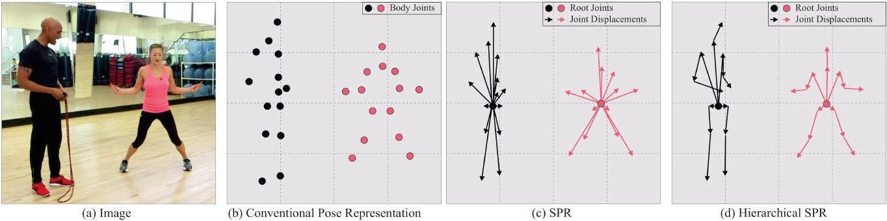
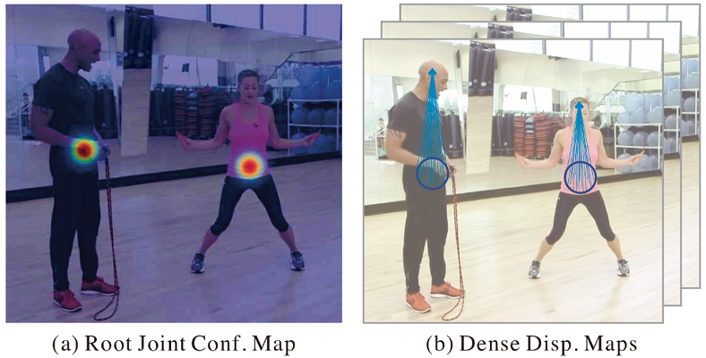

# SPM(ICCV2019)

## 1) Introduction

Paper Name: [`Single-Stage Multi-Person Pose Machines`](https://arxiv.org/abs/1908.09220). As introduced in the root README file, this paper gives the first single stage multi-person pose estimation method. The abbreviation SPM comes from its name, and there are main two kinds of pipeline: **Structured Pose Representation (SPR)** and **Hierarchical SPR**.

Different from the traditional two-stage multi-person pose estimation methods (one stage for proposal generation and the other for allocating poses to corresponding persons), SPM can simplify the pipeline and improve the efficiency. Specifically, SPM has proposed a novel architecture **Structured Pose Representation (SPR)** which can unify person instance and their keypoints position together. SPM is designed to predict the **Structured Pose** of every person in one image in a single stage directly. So the inference time is almost the same with the backbone deep model goes forward once. This is surely faster and more elegant than both Top-Down and Bottom-Up algorithms.

SPM is to some extent inspired by the one-stage anchor-free object detection algorithms appeared recent months, such as FOCS, CornerNet, CenterNet. In particular, SPR defines the root joints to indicate all persons and their corresponding body joints are encoded into offsets or displacements *w.r.t* the root joints. Considering that some keypoints are far away from the root joint, the author thought *hierarchical representations* which is called **Hierarchical SPR**. In this way, the CNN model can predict keypoints in the outer ring from the root joint layer by layer. Note that root joints and displacements are outputed by model simultaneously. The idea in the paper can easily be adjusted from 2D to 3D pose estimation.

## 2) Method Description

Below is the diagram example of SPM. (b) gives the conventional pose representation which should predict all joints of every person in the input image. (c) shows the results of SPR. (d) is Hierarchical SPR. This keypoints annotation format comes from MPII.

[comment]: <> (MathJax Plugin for Github in Google Chrome)
Suppose that we have known how the Top-Down and Bottom-Up method work. We just use simple equations to explain them briefly.

**Conventional Pose Representation:**

$\mathcal {P} = {(P^1_i, P^2_i, ..., P^K_i )}^N_{i=1}$, where $N$ is the number of persons in image $I$, $K$ is the numner of joint catagories, and $P^j_i$ is the coordinates of $j$th joint of person $i$. Note that $P^j_i$ can be either 2D case $(x^i_j, y^i_j)$ or 3D case $(x^i_j, y^i_j, z^i_j)$. To obtain $\mathcal {P}$, there are mainly two two-stage methods: Top-Down and Bottom-Up.

- **Top-Down:** It first uses a person detector $f$ to localize person instances $\mathcal {B}$ (usually a set of bounding boxes) with function {$f:I \rightarrow \mathcal {B}$}, and then conducts single-person pose estimation with model $g$ to get corresponding keypoints of every person respectively. {$g:\mathcal {B},I \rightarrow \mathcal {P}$}.

- **Bottom-Up:** This method first utilizes a keypoints estimator $g'$ to localize all body joints $\mathcal {J}$ in one image with function {$g':I \rightarrow \mathcal {J,C}$}. $\mathcal {C}$ indicates additional auxiliary vectors for assigning joint candidates to person instances. Then it performs joint allocation by sloving a graph partition problem (greedy matching in CPU) using strategy $f'$ which is formulated as {$f':\mathcal {J,C} \rightarrow \mathcal {P}$}.

**Compact and Efficient Single Stage Method SPM:** 

- **SPM:** It uses an auxiliary joint or root joint $(x^r_i, y^r_i)$ to stand for the $i$th person instance position. And the position of the $j$th joint of person $i$ is $(x^j_i, y^j_i) = (x^r_i, y^r_i) + (\delta x^r_i, \delta y^r_i)$. In the equation, $(\delta x^r_i, \delta y^r_i)$ is the *offset* of the $j$th joint position w.r.t the root joint. Then we can get the way how the SPM represent human poses: $\mathcal {P} = { [(x^r_i, y^r_i), (\delta x^1_i, \delta y^1_i), (\delta x^2_i, \delta y^2_i)..., (\delta x^K_i, \delta y^K_i)]  }^N_{i=1}$. *In the original paper, the author said that he exploited the **person centroid** as the root joint of the person instance. But how to get this **centroid point** has no explanation.*

- **Hierarchical SPR:** Offsets in SPM have different lengths of one person, and the prediction of long-range displacements turn to be bad due to possible large pose deformation. This brings challenge to offset regression by mapping from image representation to the vector domain. Hierarchical SPR factorizes long offsets into accumulative shorter ones to improve the performance. Joints are splited into four hierarchies including the root joint which is the first hierarchy. Torso joints (neck, shoulders, hips) are the second ones. Head, elbows and knees are put in the third. Wrists and ankles are put in the fourth. New formula of offsets calculation is $(x^j_i, y^j_i) = (x^{j'}_i, y^{j'}_i) + (\delta x^{j'}_i, \delta y^{j'}_i)$. Here, the $(\delta x^{j'}_i, \delta y^{j'}_i)$ is the displacement between joints in adjacent hierarchies but not w.r.t the root joint.

- **Regression target for root joint position:** We use $C^r$ to donate the confidence map of the root joint and $C^r_i$ the root joint map of the $i$th person in one given image $I$. For a position $(x,y)$ in it, $C^r_i(x,y)$ is calculated by $C^r_i(x,y) = exp(-||(x,y)  - (x^r_i, y^r_i)||^2_2 / \sigma^2)$, where $(x^r_i, y^r_i)$ is the groundtruth root joint position and $\sigma$ is the variance of Gaussian distribution which is set as $\sigma = 7$. $C^r$ is an aggregation of peaks of all persons' $C^r_i$.

- **Regression target for body joint displacement:** We use $D^j$ to donate joint $j$ map and $D^j_i$ to donate the joint $j$ of person $i$. A position $(x,y)$ in image $I$ with $D^j_i(x,y)$ calculated by $D^j_i(x,y) = (\delta x, \delta y)/Z, for (x,y) in \mathcal {N}^r_i$. Other positions $(x,y)$ in image $I$ are all zeros. Note that $(\delta x, \delta y) = (x^j_i, y^j_i) - (x,y)$ and $\mathcal {N}^r_i = [(x,y) | ||(x,y)-(x^j_i, y^j_i)||^2_2 <= \tau]$. The normalization factor $Z = \sqrt{H^2 + W^2}$, and $\tau = 7$ is for controlling the neighborhood size of every joint offset. Because some positions may be overlapped of joints displacements, $D^j$ for the $j$th joint is the average for all persons: $D^j(x,y) = (1/M^j) \sum_i{D^j_i(x,y)}$, where $M^j$ is the count of non-zero vectors at positon $(x,y)$ across all persons.

- **Loss Function:** Paper uses $\mathcal {l_2}$ loss $\mathcal {L}^C$ for root joint confidence and $\mathcal {l_1}$ loss $\mathcal {L}^D$ for dense displacement map regression respectively. The total loss $\mathcal {L}$ is the weighted sum: $\mathcal {L} = \sum^T_{t=1}{(\mathcal {L}^C(\hat{C}^r_t, C^r) + \beta \mathcal {L}^D(\hat{D}_t, D))}$, where $\hat{C}^r_t$ and $\hat{D}_t$ donate the predicted root joint confidence map and dense offset maps at the $t$th stage of Intermediate Supervision in Hourglass BackBone. The author sets weight factor $\beta = 0.01$ in his experiment.

- **Inference Procedure and Decoding:** Firstly, we use the trained CNN model to get root joint confidence map $\hat{C^r}$ and offset maps  $\hat{D}$. Then, it performs point NMS on $\hat{C^r}$ to generate root joint set $(\hat{x}^r_i, \hat{y}^r_i)^\hat{N}_i$ with $\hat{N}$ is the estimated number of persons. For the left keypoints, combining root joint positions with displacement $Z.D^j(\hat{x}^r_i, \hat{y}^r_i)$.

## 3) Source Codes

## 4) Experiment Results
