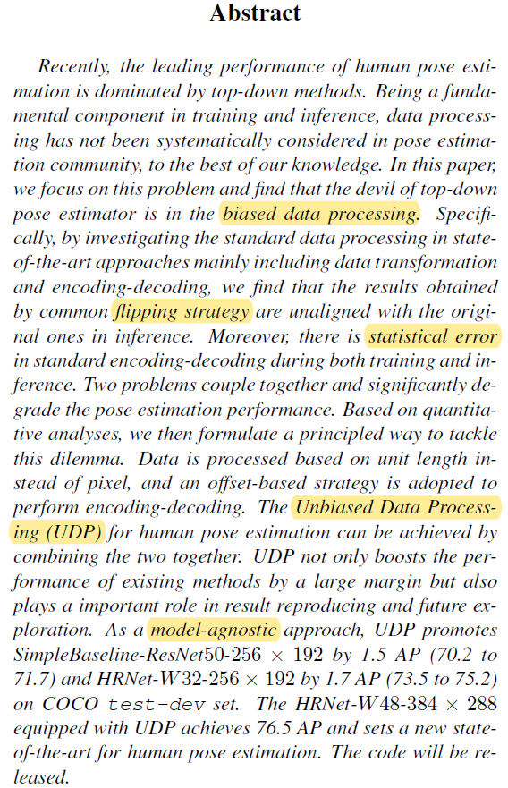
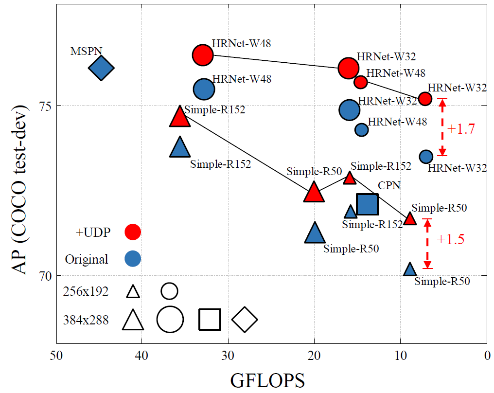
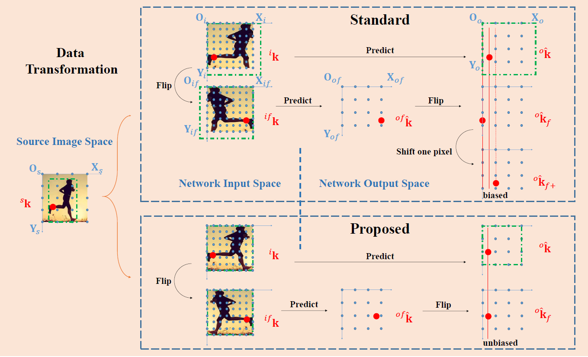

# UDP-Pose(CVPR2020)

Paper URL: https://arxiv.org/abs/1911.07524

Authors are all Chinese from Institute of Automation, Chinese Academy of Sciences. The paper full name is **The Devil Is in the Details: Delving Into Unbiased Data Processing for Human Pose Estimation**, and UDP here means Unbiased Data Processing. The official code is released in [HuangJunJie2017/UDP-Pose](https://github.com/HuangJunJie2017/UDP-Pose). 

## 0) Abstract



## 1) Introduction

UDP-Pose is either a new backbone for pose estimation nor a novel independent algorithm. It focuses on *Unbiased Data Processing* before data training and also subsequent infenence. UDP-Pose works as a plug-in for SOTA MPPE methods including HRNet and SimplePose to futher improve their mAP with less GFLOPS burden increase.



The main contribution of UDP-Pose is to discover the defects of current pose estimation algorithms during data processing both in training and infenence, and then propose an unbiased data transformation pipeline. This method can be used as a model independent plug-in, combined with other methods, to enhance their mAP on the common datasets. Illustration for the processes between *standard biased data transformation* and proposed *unbiased data transformation* is below. In this paper, a lot of complicated mathematical formulas of error analysis are involved. Comprehension of my reading will be showed later.




## 2) Intensive Reading


## 3) Citation
Please cite the paper in your publications if it helps your research:
```
@InProceedings{Huang_2020_CVPR,
author = {Huang, Junjie and Zhu, Zheng and Guo, Feng and Huang, Guan},
title = {The Devil Is in the Details: Delving Into Unbiased Data Processing for Human Pose Estimation},
booktitle = {The IEEE/CVF Conference on Computer Vision and Pattern Recognition (CVPR)},
month = {June},
year = {2020}
}
```
