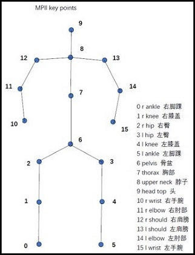

# Pose Estimation

## 1) Introduction
The general definition of `Human Pose Estimation` is as follows: Given a picture containing human body, the position of human joints can be detected, and the joints can be connected in a predetermined order to form pose. If there are multiple people, the joints should not be confused. Therefore, the pose estimation can be divided into two categories, `single` and `multiple`.


In terms of implementation method, pose estimation has two branches: `Top-down` and `Bottom-up`. `Top-down` first uses the human detector to get bounding boxes of bodies in the image, and then estimates the pose of each person. `Bottom-up` directly predicts the position of all human joints in the image, and then use post-processing algorithm to link them into complete poses. The performance of the former method is mainly dominated by detectors and easy to slaughter on public datasets than the latter, but its inference time of single image increases linearly with the number of people, and it does not perform well in crowded, cluttered and occluded scenes. The latter method is easy to perform poorly because of the problem of joint point connection algorithm, but its detection time is relatively stable, and there will be no big error in the case of crowding.


## 2) Datasets
At present, the mainstream schemes for pose estimation are all based on data-driven deep learning methods. And there are two popular public datasets, [MPII Human Pose Dataset](http://human-pose.mpi-inf.mpg.de/)(CVPR2014)[1] and [COCO: Common Objects in Context](http://cocodataset.org/)(ECCV2014)[2]. Although there is a detailed description of datasets on the official website, here is a brief summary of the important information for a quick start.




**MPII Human Pose Dataset**

The dataset includes around *25K images* (precisely 24984) containing over *40K people* with annotated body joints. Overall the dataset covers *410 human activities* and each image is provided with an activity label. Each image was extracted from a YouTube video which is not very clear. And according to standard practice, authors withhold the test annotations to prevent overfitting and tuning on the test set. For external testing, an automatic evaluation server and performance analysis tools are provided.
```
# 16 joint points
joints_name_dict = {0: 'r ankle', 1: 'r knee', 2: 'r hip', 3: 'l hip', 
    4: 'l knee', 5: 'l ankle', 6: 'pelvis', 7: 'thorax',
    8: 'upper neck', 9: 'head top', 10: 'r wrist', 11: 'r elbow', 
    12: 'r shoulder', 13: 'l shoulder', 14: 'l elbow', 15: 'l wrist'}
# 15 limb pairs
limb_connection_list = [[0, 1], [1, 2], [2, 6], [3, 6], [3, 4], [4, 5], [6, 7], [7, 8], [8, 9], 
    [8, 12], [8, 13], [10, 11], [11, 12], [13, 14], [14, 15]]
```

**COCO: Common Objects in Context**

The dataset contains *91 common object categories* with 82 of them having more than 5,000 labeled instances. With a total of *2.5 million labeled instances* in *328K images*, the creation of the dataset drew upon extensive crowd worker involvement via novel user interfaces for *category detection*, *instance spotting* and *instance segmentation*. As for human keypoints annotation, it has been updated in later releases (after 2014).

The main contribution of COCO datasets is the use of *Non-iconic Image Collection* which makes it different from traditional vision datasets including [ImageNet](http://www.image-net.org/)(CVPR2009)[3], [PASCAL VOC](http://host.robots.ox.ac.uk:8080/pascal/VOC/)(IJCV2010)[4] and [SUN](http://groups.csail.mit.edu/vision/SUN/)(CVPR2010)[5]. Besides, the standardized labeling pipeline and a large amount of time investment make COCO the most commonly used dataset by scientific researchers at present.

```
# 18 joint points
joints_name_dict = {0: 'nose', 1: 'neck', 2: 'Rshoulder', 3: 'Relbow', 4: 'Rwrist', 5: 'Lshoulder',
    6: 'Lelbow', 7: 'Lwrist', 8: 'Rhip', 9: 'Rknee', 10: 'Rankle', 11: 'Lhip',
    12: 'Lknee', 13: 'Lankle', 14: 'Leye', 15: 'Reye', 16:'Lear', 17:'Rear'}
# 17 limb pairs, 19 limb pairs with two adding connections [2, 16] and [5, 17]
limb_connection_list = [[1, 2], [1, 5], [2, 3], [3, 4], [5, 6], [6, 7],
    [1, 8], [8, 9], [9, 10], [1, 11], [11, 12], [12, 13], [1, 0],
    [0, 14], [14, 16], [0, 15], [15, 17]]
```

## 3) SOTA Algorithms

**Top-down**

**Bottom-up**

①PifPaf(CVPR2019)[6]

②PersonLab(ECCV2018)[7]

③PAF(CVPR2017)[8]

④Associative Embedding(NIPS2017)[9]

⑤MultiPoseNet(ECCV2018)[10]


## 4) References
[1] M. Andriluka, L. Pishchulin, P. Gehler, and B. Schiele. 2d human pose estimation: New benchmark and state of the art analysis. In IEEE Conference on Computer Vision and Pattern Recognition (CVPR), June 2014.

[2] T.-Y. Lin, M. Maire, S. Belongie, J. Hays, P. Perona, D. Ramanan, P. Dollar, and C. L. Zitnick. Microsoft coco: Common objects in context. In European conference on computer vision, pages 740-755. Springer, 2014.

[3] J. Deng, W. Dong, R. Socher, L.-J. Li, K. Li, and L. Fei-Fei, “ImageNet: A Large-Scale Hierarchical Image Database,” in CVPR,
2009. 

[4] M. Everingham, L. Van Gool, C. K. I.Williams, J.Winn, and A. Zisserman, “The PASCAL visual object classes (VOC) challenge,” IJCV, vol. 88, no. 2, pp. 303–338, Jun. 2010.

[5] J. Xiao, J. Hays, K. A. Ehinger, A. Oliva, and A. Torralba, “SUN database: Large-scale scene recognition from abbey to zoo,” in
CVPR, 2010.

[6] Kreiss, Sven and Bertoni, Lorenzo and Alahi, Alexandre. PifPaf: Composite Fields for Human Pose Estimation. The IEEE Conference on Computer Vision and Pattern Recognition (CVPR), June, 2019.

[7] G. Papandreou, T. Zhu, L. Chen, S. Gidaris, J. Tompson, and K. Murphy. Personlab: Person pose estimation and instance segmentation with a bottomup, part-based, geometric embedding model. CoRR, abs/1803.08225, 2018. 2, 4, 5, 6, 8

[8] Z. Cao, T. Simon, S.-E. Wei, and Y. Sheikh. Realtime multi-person 2d pose estimation using part affinity fields. In CVPR, volume 1, page 7, 2017. 1, 2, 6, 7, 8

[9] A. Newell, Z. Huang, and J. Deng. Associative embedding: End-to-end learning for joint detection and grouping. In Advances in Neural Information Processing Systems, pages 2277-2287, 2017. 2

[10] M. Kocabas, S. Karagoz, and E. Akbas. Multiposenet: Fast multi-person pose estimation using pose residual network. European Conference on Computer Vision (ECCV), 2018.

