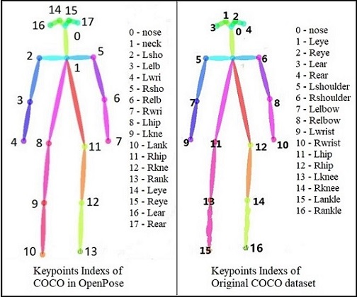

# Pose Estimation


## 1) Introduction
The general definition of `Human Pose Estimation` is as follows: Given a picture containing human body, the position of human joints can be detected, and the joints can be connected in a predetermined order to form pose. If there are multiple people, the joints should not be confused. Therefore, the pose estimation can be divided into two categories, `single` and `multiple`.


In terms of implementation method, pose estimation has two branches: `Top-down` and `Bottom-up`. `Top-down` first uses the human detector to get bounding boxes of bodies in the image, and then estimates the pose of each person. `Bottom-up` directly predicts the position of all human joints in the image, and then use post-processing algorithm to link them into complete poses.

The performance of the former method is mainly dominated by detectors and easy to slaughter on public datasets than the latter, but its inference time of single image increases linearly with the number of people, and it does not perform well in crowded, cluttered and occluded scenes. The latter method is easy to perform poorly because of the problem of joint point connection algorithm, but its detection time is relatively stable, and there will be no big error in the case of crowding.


**=== Add in 2019-12-17: Single Stage Pose Estimation ===**

Recently, with the rise of *single stage anchor-free* methods (like **CornerNet, FCOS, CenterNet**, and so on) in the field of object detection, the branch of single stage also appears in pose estimation. These anchor-free methods usually choose to predict the center point of an object and some offsets/displacements from the root point. For example, to get the rectangular bounding-box of an object, it can predict the width and height as offsets.

Following this idea, single stage pose estimation can define a root joint of person, and the positions of the other keypoints are displacements *w.r.t.* the root point. So we can design an end-to-end single stage network to predict the center representative point and offsets of other joints. Obviously, single stage is more intuitive and compact than the traditional two-stage methods that suffer low efficiency. Below is an example diagram from a work **ICCV2019: Single-Stage Multi-Person Pose Machines**. It might be the first algorithm to produce single-stage MPPE. And it will bring a new hot spot which makes MPPE closer to real application.


## 2) Datasets
At present, the mainstream schemes for pose estimation are all based on data-driven deep learning methods. And there are two popular public datasets, [MPII Human Pose Dataset](http://human-pose.mpi-inf.mpg.de/)(CVPR2014)[1] and [COCO: Common Objects in Context](http://cocodataset.org/)(ECCV2014)[2]. Although there is a detailed description of datasets on the official website, here is a brief summary of the important information for a quick start.

<table>
<tr>
<th>MPII Keypoints Indexs</th>
<th>COCO Keypoints Indexs</th>
<th>AIC Keypoints Indexs</th>
</tr>
<tr>
<td></td>
<td></td> 
<td></td>
</tr>
</table>


* **MPII Human Pose Dataset**

The dataset includes around *25K images* (precisely 24984) containing over *40K people* with annotated body joints. Overall the dataset covers *410 human activities* and each image is provided with an activity label. Each image was extracted from a YouTube video which is not very clear. And according to standard practice, authors withhold the test annotations to prevent overfitting and tuning on the test set. For external testing, an automatic evaluation server and performance analysis tools are provided.
```
# 16 joint points
joints_name_dict = {0: 'r ankle', 1: 'r knee', 2: 'r hip', 3: 'l hip', 
    4: 'l knee', 5: 'l ankle', 6: 'pelvis', 7: 'thorax',
    8: 'upper neck', 9: 'head top', 10: 'r wrist', 11: 'r elbow', 
    12: 'r shoulder', 13: 'l shoulder', 14: 'l elbow', 15: 'l wrist'}
# 15 limb pairs
limb_connection_list = [[0, 1], [1, 2], [2, 6], [3, 6], [3, 4], [4, 5], [6, 7], [7, 8], [8, 9], 
    [8, 12], [8, 13], [10, 11], [11, 12], [13, 14], [14, 15]]
```

* **COCO: Common Objects in Context**

The dataset contains *91 common object categories* with 82 of them having more than 5,000 labeled instances. With a total of *2.5 million labeled instances* in *328K images*, the creation of the dataset drew upon extensive crowd worker involvement via novel user interfaces for *category detection*, *instance spotting* and *instance segmentation*. As for human keypoints annotation, it has been updated in later releases (after 2014).

The main contribution of COCO datasets is the use of *Non-iconic Image Collection* which makes it different from traditional vision datasets including [ImageNet](http://www.image-net.org/)(CVPR2009)[3], [PASCAL VOC](http://host.robots.ox.ac.uk:8080/pascal/VOC/)(IJCV2010)[4] and [SUN](http://groups.csail.mit.edu/vision/SUN/)(CVPR2010)[5]. Besides, the standardized labeling pipeline and a large amount of time investment make COCO the most commonly used dataset by scientific researchers at present.

```
joint_vis: { 0: "invisible", 1: "occlude", 2: "visible" }

# 18 joint points (Note: original COCO dataset actually has 17 points, the point 1 'neck' 
# is a secondary addition of middle point between 'Lshoulder' and 'Rshoulder')

joints_name_dict_18 = {0: 'nose', 1: 'neck', 2: 'Lshoulder', 3: 'Lelbow', 4: 'Lwrist', 
    5: 'Rshoulder', 6: 'Relbow', 7: 'Rrist', 8: 'Lhip', 9: 'Lknee', 10: 'Lankle', 
    11: 'Rhip', 12: 'Rknee', 13: 'Rankle', 14: 'Leye', 15: 'Reye', 16:'Lear', 17:'Rear'}
    
joints_name_dict_17 = {0: 'nose', 1: 'Leye', 2: 'Reye', 3: 'Lear', 4: 'Rear', 
    5: 'Lshoulder', 6: 'Rshoulder', 7: 'Lelbow', 8: 'Relbow', 9: 'Lwrist', 10: 'Rrist', 
    11: 'Lhip', 12: 'Rhip', 13: 'Lknee', 14: 'Rknee', 15: 'Lankle', 16: 'Rankle'}
    
# For 18 joint points, there are 17 limb pairs, 19 limb pairs with two adding connections [2, 16] and [5, 17]
limb_connection_list = [[1, 2], [1, 5], [2, 3], [3, 4], [5, 6], [6, 7], [1, 8], [8, 9], [9, 10], [1, 11], 
    [11, 12], [12, 13], [1, 0], [0, 14], [14, 16], [0, 15], [15, 17]]
    
# For 17 joint points, there are 19 limb pairs
limb_connection_list = [[16,14],[14,12],[17,15],[15,13],[12,13],[6,12],[7,13],[6,7],[6,8],[7,9],[8,10],[9,11],
    [2,3],[1,2],[1,3],[2,4],[3,5],[4,6],[5,7]]
```

* **AI Challenger**

```
joint_vis: { 1: "visible", 2: "occlude", 3: "invisible"}

# 14 joint points
joints_name_dict_14 = { 0: "right shoulder", 1: "right elbow", 2: "right wrist", 
    3: "left shoulder", 4: "left elbow", 5: "left wrist", 
    6: "right hip", 7: "right knee", 8: "right ankle", 
    9: "left hip", 10: "left knee", 11: "left ankle", 12: "head tops", 13: "upper neck"}

# 13 limb pairs
limb_connection_list = [[12,13],[13,0],[0,1],[1,2],[13,3],[3,4],[4,5],
    [13,6],[6,7],[7,8],[13,9],[9,10],[10,11]]
```


## 3) SOTA Algorithms Interpretation

* **Single Person Pose Estimation**

① [DeepPose(CVPR2014)](./DeepPose/) Toshev, A., Szegedy, C.: DeepPose: Human Pose Estimation via Deep Neural Networks. In: CVPR. (2014)

② [PoseMachines(ECCV2014)](./PoseMachines/) Ramakrishna V , Munoz D , Hebert M , et al. Pose Machines: Articulated Pose Estimation via Inference Machines. In: ECCV. (2014)

③ [StackedHourglass(ECCV2016)](./StackedHourglass/) Newell, A., Yang, K., Deng, J.: Stacked hourglass networks for human pose estimation. In: ECCV. (2016)

④ [CPM(CVPR2016)](./CPM/) Wei, S.E., Ramakrishna, V., Kanade, T., Sheikh, Y.: Convolutional pose machines. In: CVPR. (2016)

⑥ [UniPose(CVPR2020)](./UniPose/) Artacho B , Savakis A . UniPose: Unified Human Pose Estimation in Single Images and Videos. In: CVPR. (2020)

* **Multi-Person Pose Estimation: Top-down**

① [G-RMI(CVPR2017)](./G-RMI/) Papandreou, G., Zhu, T., Kanazawa, N., Toshev, A., Tompson, J., Bregler, C., Murphy, K.: Towards accurate multi-person pose estimation in the wild. In: CVPR. (2017)

② [Mask-RCNN(ICCV2017)](./Mask-RCNN/) Kaiming He, Georgia Gkioxari, Piotr Dollar, Ross Girshick; Mask R-CNN. The IEEE International Conference on Computer Vision (ICCV), 2017, pp. 2961-2969

③ [RMPE(ICCV2017)](./RMPE/) Fang, H.S., Xie, S., Tai, Y.W., Lu, C.: RMPE: Regional multi-person pose estimation. In: ICCV. (2017)

④ [CPN(CVPR2018)](./CPN/) Chen Y , Wang Z , Peng Y , et al. Cascaded Pyramid Network for Multi-Person Pose Estimation[J]. In: CVPR. (2018)

⑤ [HRNet(CVPR2019)](./HRNet/) Sun K , Xiao B , Liu D , et al. Deep High-Resolution Representation Learning for Human Pose Estimation. In: CVPR. (2019)

⑥ [DarkPose(CVPR2020)](./DarkPose) Zhang F , Zhu X , Dai H , et al. Distribution-Aware Coordinate Representation for Human Pose Estimation[C]// 2020 IEEE/CVF Conference on Computer Vision and Pattern Recognition (CVPR). IEEE, 2020.

⑦ [UDP-Pose(CVPR2020)](./UDP-Pose) Huang J , Zhu Z , Guo F , et al. The Devil Is in the Details: Delving Into Unbiased Data Processing for Human Pose Estimation[C]// 2020 IEEE/CVF Conference on Computer Vision and Pattern Recognition (CVPR). IEEE, 2020.

* **Multi-Person Pose Estimation: Bottom-up**

① [ArtTrack(CVPR2017)](./ArtTrack/) Insafutdinov, E., Andriluka, M., Pishchulin, L., Tang, S., Andres, B., Schiele, B.: ArtTrack: Articulated multi-person tracking in the wild. In: CVPR. (2017)

② [AssociativeEmbedding(NIPS2017)](./AssociativeEmbedding/) A. Newell, Z. Huang, and J. Deng. Associative embedding: End-to-end learning for joint detection and grouping. In Advances in Neural Information Processing Systems, pages 2277-2287, 2017. 2

③ [PAF_CMU-OpenPose(CVPR2017)](./PAF_CMU-OpenPose/) Z. Cao, T. Simon, S.-E. Wei, and Y. Sheikh. Realtime multi-person 2d pose estimation using part affinity fields. In CVPR, volume 1, page 7, 2017. 1, 2, 6, 7, 8

④ [PersonLab(ECCV2018)](./PersonLab/) G. Papandreou, T. Zhu, L. Chen, S. Gidaris, J. Tompson, and K. Murphy. Personlab: Person pose estimation and instance segmentation with a bottomup, part-based, geometric embedding model. CoRR, abs/1803.08225, 2018. 2, 4, 5, 6, 8

⑤ [MultiPoseNet(ECCV2018)](./MultiPoseNet/) M. Kocabas, S. Karagoz, and E. Akbas. Multiposenet: Fast multi-person pose estimation using pose residual network. European Conference on Computer Vision (ECCV), 2018.

⑥ [PifPaf(CVPR2019)](./PifPaf/) Kreiss, Sven and Bertoni, Lorenzo and Alahi, Alexandre. PifPaf: Composite Fields for Human Pose Estimation. The IEEE Conference on Computer Vision and Pattern Recognition (CVPR), June, 2019.

⑦ [HigherHRNet(CVPR2020)](./HigherHRNet/) Cheng B , Xiao B , Wang J , et al. HigherHRNet: Scale-Aware Representation Learning for Bottom-Up Human Pose Estimation[C]// 2020 IEEE/CVF Conference on Computer Vision and Pattern Recognition (CVPR). IEEE, 2020.


* **Multi-Person Pose Estimation: Single-Stage**

① [SPM(ICCV2019)](./SPM/) Nie X, Feng J, Zhang J, et al. Single-stage multi-person pose machines[C]//Proceedings of the IEEE International Conference on Computer Vision. 2019: 6951-6960.

② [DirectPose(arxiv1911)](./DirectPose/) Tian Z, Chen H, Shen C. DirectPose: Direct End-to-End Multi-Person Pose Estimation[J]. arXiv preprint arXiv:1911.07451, 2019.

## 4) References
* **dataset papers**

[1] M. Andriluka, L. Pishchulin, P. Gehler, and B. Schiele. 2d human pose estimation: New benchmark and state of the art analysis. In IEEE Conference on Computer Vision and Pattern Recognition (CVPR), June 2014.

[2] T.-Y. Lin, M. Maire, S. Belongie, J. Hays, P. Perona, D. Ramanan, P. Dollar, and C. L. Zitnick. Microsoft coco: Common objects in context. In European conference on computer vision, pages 740-755. Springer, 2014.

[3] J. Deng, W. Dong, R. Socher, L.-J. Li, K. Li, and L. Fei-Fei, “ImageNet: A Large-Scale Hierarchical Image Database,” in CVPR,
2009. 

[4] M. Everingham, L. Van Gool, C. K. I.Williams, J.Winn, and A. Zisserman, “The PASCAL visual object classes (VOC) challenge,” IJCV, vol. 88, no. 2, pp. 303–338, Jun. 2010.

[5] J. Xiao, J. Hays, K. A. Ehinger, A. Oliva, and A. Torralba, “SUN database: Large-scale scene recognition from abbey to zoo,” in CVPR, 2010.


## 5) Statement

This project is only for academic discussion and exchange, not for commercial purposes.
