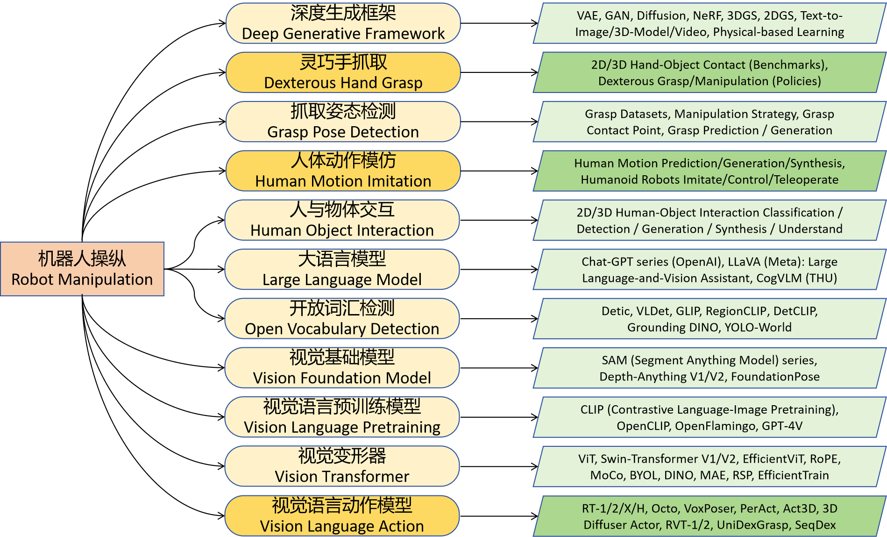

# Robot Manipulation
*also closely-related to `Artificial General Intelligence`, `Embodied Artificial Intelligence` and `Embodiment of AI`*

This is a mixed collection of many different fields including `Dexterous Hand Grasp`, `Grasp Pose Detection`, `Human Object Interaction`, `Human Motion Imitation`, `Deep Generative Framework`,  `Open Vocabulary Detection`, `Vision Foundation Model`, `Large Language Model`, `Vision Language Pretraining`, `Vision Language Action` and `Vision Transformer`. We assume that all of these fields will have a quite close and also positive impact on the final goal `Robot Manipulation`.

***

## Other References

* [The Roadmap and Technical Challenges of Sim2Real Embodied AI (with a focus on generalist robotic manipulation)](https://dexforce.feishu.cn/wiki/Zsubw2FIriW8gRkpesFcwiCvnpA) [authored by [`Kui Jia`](http://kuijia.site/)]

